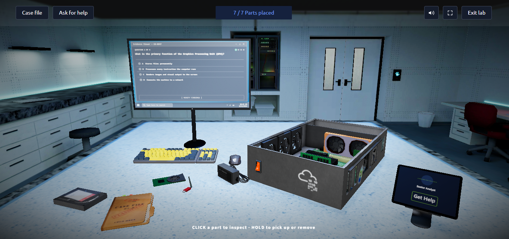

# Reporte de Laboratorio: Introducción a la Forense Digital y Recuperación de Hardware
**Plataforma:** TryHackMe  
**Módulo:** Digital Forensics / Pre-Security  
**Fecha:** Septiembre 2026  

---

## 1. Descripción del Escenario
Durante un incidente de seguridad, unos atacantes ingresaron a las instalaciones y destruyeron físicamente un equipo de cómputo para intentar destruir evidencia y ganar tiempo de escape. 

**Objetivo:** Reconstruir físicamente la computadora afectada, validar los componentes básicos de hardware y encender el sistema para permitir la extracción de datos y memoria por parte del equipo de forense digital.

---

## 2. Proceso de Reconstrucción de Hardware

Para poner la estación de trabajo operativa, se identificaron e instalaron los **7 componentes esenciales**:
1. Procesador (CPU)
2. Memoria RAM
3. Tarjeta de Video (GPU)
4. Fuente de Alimentación (PSU)
5. Unidades de Almacenamiento (HDD/SSD)
6. Tarjeta de Red (NIC)
7. Sistema de Enfriamiento / Ventiladores

*Figura 1: Ensamble completo del hardware en el banco de trabajo (7/7 partes colocadas).*

---

## 3. Extracción de Evidencia Forense

Una vez rearmado el equipo, se ejecutó una técnica de **recuperación en frío (Cold Boot)** para extraer la imagen de la memoria RAM antes de que los datos volátiles se perdieran.

*Figura 2: Generación exitosa del reporte forense indicando acceso remoto no autorizado vía VPN comprometida y obtención de la bandera de validación.*

### Resultados Obtenidos:
* **Vector de ataque confirmado:** Acceso remoto a la red interna mediante credenciales/VPN comprometida.
* **Flag de validación:** `THM{c0ld_b00t_c0mpl3t3}`

---

## 4. Conclusión Técnica y Defensiva
Este ejercicio demuestra la importancia de la **Preservación de Evidencia Física y Volátil**. Como analista defensivo, no solo es necesario revisar logs en pantalla, sino entender cómo interactúa el hardware con la adquisición forense para responder rápidamente ante incidentes de sabotaje.
