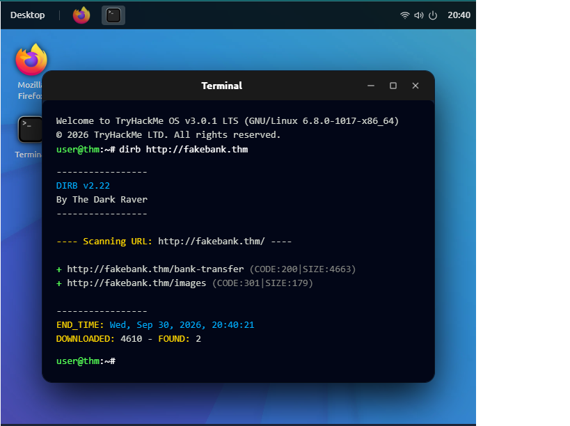

# Reporte de Análisis de Incidentes y Seguridad Ofensiva: Hack the Bank

**Plataforma:** TryHackMe  
**Módulo:** Introduction to Cyber Security  
**Fecha:** Septiembre 2026  
**Analista:** LeGrand Castillo  

---

## 1. Resumen Ejecutivo
El presente informe documenta la simulación de ataque y posterior análisis defensivo realizado sobre la plataforma financiera `http://fakebank.thm`. Se identificó un fallo crítico de control de acceso (*Broken Access Control*) precedido por una fase de reconocimiento mediante enumeración de directorios, culminando en la ejecución de una transferencia monetaria no autorizada.

---

## 2. Alcance y Objetivos
* **Objetivo Principal:** Evaluar la postura de seguridad de la aplicación web y determinar el impacto de rutas no indexadas.
* **Vector Evaluado:** Servicios HTTP/HTTPS y rutas administrativas.
* **Métrica de Éxito:** Identificación de vulnerabilidades, explotación controlada para obtención de prueba de concepto (PoC) y generación de recomendaciones de mitigación.

---

## 3. Fase 1: Reconocimiento y Enumeración de Directorios
Para descubrir la estructura del sitio web y localizar recursos no vinculados en el menú principal, se utilizó la herramienta de auditoría de seguridad **DIRB** desde la línea de comandos de Linux.

```bash
dirb [http://fakebank.thm](http://fakebank.thm)
´´´

## : La captura de pantalla muestra la ejecución del escáner DIRB v2.22 apuntando al objetivo http://fakebank.thm. La herramienta realizó una fuerza bruta de directorios analizando códigos de respuesta HTTP, encontrando exitosamente dos recursos críticos:

http://fakebank.thm/bank-transfer (Código 200 OK / Tamaño: 4663 bytes).

http://fakebank.thm/images (Código 301 Redirect / Tamaño: 179 bytes).
