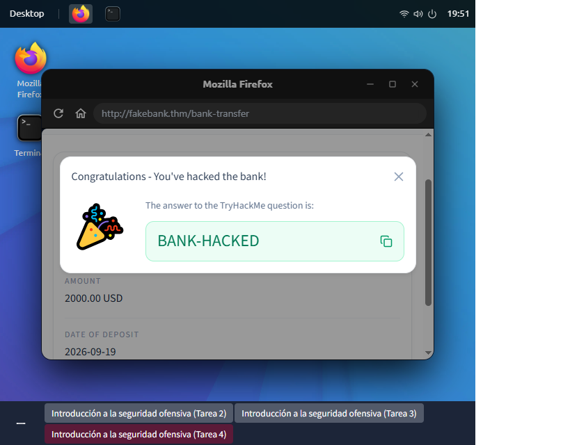

# Reporte de Análisis de Incidentes y Seguridad Ofensiva: Hack the Bank

**Plataforma:** TryHackMe  
**Módulo:** Introduction to Cyber Security  
**Fecha:** Septiembre 2026  
**Analista:** LeGrand Castillo  

---

## 1. Resumen Ejecutivo
El presente informe documenta la simulación de ataque y posterior análisis defensivo realizado sobre la plataforma financiera `http://fakebank.thm`. Se identificó un fallo crítico de control de acceso (*Broken Access Control*) precedido por una fase de reconocimiento mediante enumeración de directorios, culminando en la ejecución de una transferencia monetaria no autorizada.

---

## 2. Alcance y Objetivos
* **Objetivo Principal:** Evaluar la postura de seguridad de la aplicación web y determinar el impacto de rutas no indexadas.
* **Vector Evaluado:** Servicios HTTP/HTTPS y rutas administrativas.
* **Métrica de Éxito:** Identificación de vulnerabilidades, explotación controlada para obtención de prueba de concepto (PoC) y generación de recomendaciones de mitigación.

---

## 3. Fase 1: Reconocimiento y Enumeración de Directorios
Para descubrir la estructura del sitio web y localizar recursos no vinculados en el menú principal, se utilizó la herramienta de auditoría de seguridad **DIRB** desde la línea de comandos de Linux.

```bash
dirb http://fakebank.thm
```
---

## : 

* La captura de pantalla muestra la ejecución del escáner DIRB v2.22 apuntando al objetivo http://fakebank.thm. La herramienta realizó una fuerza bruta de directorios analizando códigos de respuesta HTTP, encontrando exitosamente dos recursos críticos:

http://fakebank.thm/bank-transfer (Código 200 OK / Tamaño: 4663 bytes).

http://fakebank.thm/images (Código 301 Redirect / Tamaño: 179 bytes).

---

## 4. Fase 2: Explotación y Control de Acceso Vulnerable (Broken Access Control)

Al ingresar directamente a la URL descubierta (http://fakebank.thm/bank-transfer), el sistema permitió el acceso inmediato al panel de administración de personal (Staff Account / Admin Portal) sin solicitar credenciales ni token de sesión activo.

## :
Se muestra el formulario web del panel administrativo. Se procedió a interactuar con los campos de entrada:
* **Cuenta de destino:** Se seleccionó la cuenta objetivo Acc 8881.
* **Monto a depositar:** Se especificó una cantidad de 2,000 USD.
* **Acción:** Ejecución del comando mediante el botón Deposit Money.

---

## 5. Fase 3: Post-Explotación y Verificación de Impacto
Tras enviar la solicitud HTTP POST, el backend procesó el depósito sin validar la identidad ni la autorización del emisor. La transacción fue aprobada de forma instantánea.

##  :
La interfaz desplegó una confirmación visual de la vulneración exitosa, entregando el identificador único o flag asignado por la plataforma:
* **Respuesta del sistema:** "Congratulations - You've hacked the bank!"
* **Flag asignada:** BANK-HACKED

---

## 6. Fase 4: Matriz de Clasificación del Incidente
| Parámetro | Detalle / Hallazgo |
| :--- | :--- |
| **Tipo de Vulnerabilidad** | OWASP A01:2021 – Broken Access Control |
| **Herramienta Ofensiva Usada** | DIRB (Directory Brute Forcer) |
| **Criticidad OWASP** | Alta (CVSS v3: 8.6) |
| **Causa Raíz** | Falta de controles de autenticación en la ruta `/bank-transfer` |
| **Prueba de Exposición (Flag)** | `BANK-HACKED` |

---

## 7. Fase 5: Contención, Erradicación y Remedación (Enfoque SOC)

Para contener y mitigar este tipo de incidentes en un entorno de producción real, se establecen las siguientes medidas defensivas:

  ## Medidas Inmediatas (Contención y Erradicación)
* **Restricción de Ruta:** Bloquear temporalmente el acceso público a la ruta /bank-transfer a nivel de servidor web (Apache/Nginx) o mediante reglas de Firewall de Aplicación Web (WAF).
* **Invalidación de Sesiones:** Asegurar que cualquier transacción bancaria requiera una sesión re-autenticada y un segundo factor de autenticación (2FA/MFA).
  ##Medidas Estratégicas (Remedación a Largo Plazo)
* **Implementación de RBAC:** Configurar un Control de Acceso Basado en Roles (Role-Based Access Control) en la capa del backend, validando en cada petición que el usuario pertenezca al rol Admin.
* **Uso de Tokens Anti-CSRF:** Incorporar tokens aleatorios de un solo uso (Custom Anti-CSRF Tokens) en todos los formularios de transferencia financiera.
* **Hardening del Servidor Web:** Deshabilitar el listado e inspección de directorios no indexados y configurar encabezados de seguridad HTTP.

---

## 8. Fase 6: Monitoreo y Reglas de Detección (SIEM / Logs)

Un Analista SOC debe identificar estos patrones en los registros de eventos (logs):

* **Detección de Escaneo (DIRB):** Configurar alertas en el SIEM ante ráfagas de peticiones HTTP GET dirigidas a rutas inexistentes (404 Not Found) desde una sola IP en un intervalo menor a 60 segundos.
* **Detección de Accesos Anómalos:** Monitorear respuestas HTTP 200 OK en la ruta /bank-transfer provenientes de direcciones IP externas o no pertenecientes a la red interna corporativa.

---

## 9. Lecciones Aprendidas
El ejercicio demuestra que la seguridad no puede depender del "ocultamiento" de direcciones URL (Security through obscurity). Un atacante utilizará herramientas automatizadas de reconocimiento para mapear la infraestructura en cuestión de minutos. Toda función crítica o financiera debe contar con validaciones estrictas en el lado del servidor (Server-Side Validation).
